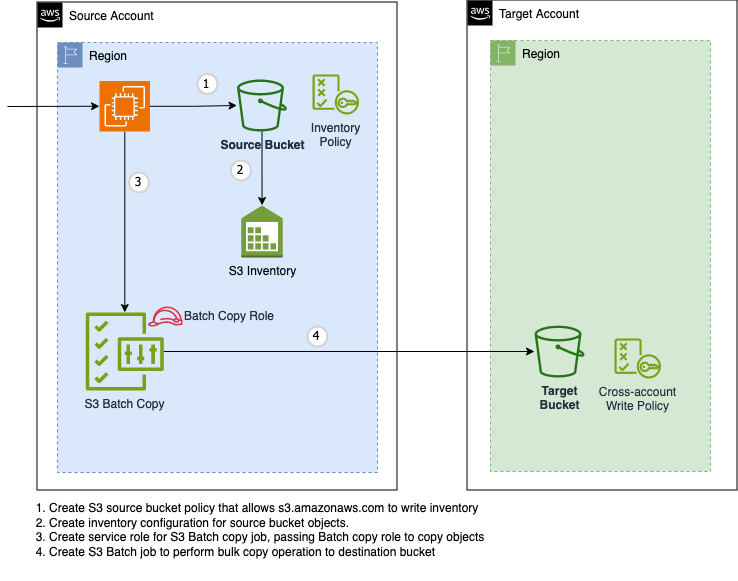

# Utility For S3 Migration
The S3 Migration utility is a tool that allows you to perform bulk copy operations for large bucket objects from one bucket to another bucket (within or across accounts). It uses [Amazon S3 Batch Operations](https://aws.amazon.com/s3/features/batch-operations/) to efficiently copy objects in batches, reducing the time and bandwidth required for the migration process.

## Use Cases 
- Copy Cross Account/With in account S3 Objects from source bucket to destination bucket
- Copy versioned or non versioned bucket objects
- Copy latest version only objects
- Provision to provide S3 bucket encryption KMS id.
- Custom objects filter options
    - Start/End object updation dates
    - Latest only, copy latest object from versioned enable bucket.
    - ACL eforcement.

## Architecture

## Background
[Amazon S3 Batch Operations](https://aws.amazon.com/s3/features/batch-operations/) provides a toolkit for performing bulk operations on S3 buckets, rather than being a fully automated service. To successfully copy an S3 bucket using S3 Batch, you need to have several components configured:

1) An inventory file for the source bucket that is formatted properly for S3 Batch and uploaded to an S3 location that S3 Batch can access. [Amazon S3 Inventory](https://docs.aws.amazon.com/AmazonS3/latest/userguide/storage-inventory.html) provides a best practice method for creating these inventory files.  

2) An IAM role that grants the S3 Batch service permissions to access the source and destination buckets as well as assume the role to perform the copy.  

3) For cross-account bucket copies, the destination bucket must have a bucket policy allowing the S3 Batch service access.

So while S3 Batch Operations enables bulk S3 bucket operations like copies, it requires the user to first setup several permissions, inventory files, and policies for it to function properly. It is more of a toolkit that leverages other Amazon S3 features rather than an fully automated solution.

This ```utility-for-s3-migration``` utility offers an automated solution for copying Amazon S3 buckets and objects, handling several of the necessary components behind the scenes. This custom utility sets up the required inventory files, IAM roles with appropriate access permissions, and destination bucket policies to enable S3 Batch Operations to copy S3 buckets. The utility-for-s3-migration also allows users to define filters to control which objects get copied, adding a level of granular control. By handling much of the underlying configuration required for S3 Batch Operations, the utility-for-s3-migration utility provides automated, filtered copies of S3 data with minimal manual intervention required.

## Prerequisites

### Inventory configuration
A new inventory configuration can take between <b>24-48 </b> hours to deliver the first inventory result.  This orchestrator wraps up all the complexity into a service that can be deployed to manage a single bucket copy.

### Permission for inventory configuration
Source bucket should have inventory report creation permission. 
IAM role should have inventory creation policy attached ```s3:PutInventoryConfiguration``` and get inventory ``` GETInventoryConfiguration``` permission
### Source Bucket
```json
{
  "Version": "2012-10-17",
  "Statement": [
    {
      "Effect": "Allow",
      "Action": [
        "s3:GETInventoryConfiguration",
        "s3:GetBucketVersioning"
      ],
      "Resource": [
        "arn:aws:s3:::<SOURCE_BUCKET_NAME>"
      ]
    },
    {
      "Effect": "Allow",
      "Action": [
        "s3:PutInventoryConfiguration"
      ],
      "Resource": [
        "arn:aws:s3:::<SOURCE_BUCKET_NAME>"
      ],
      "Condition":{
        "ForAllValues:StringEuals":{
          "s3:InventoryAccessibleOptionalFields":[
            "Size",
            "LastModifiedDate",
            "ReplacationStatus"
          ]
        }
      }
    }
  ]
}
```
IAM Role should have permission for s3 batch operation like create job and list jobs

```json
{
  "Action": [
    "s3:CreateJob",
    "s3:ListJobs"
  ],
  "Effect": "Allow",
  "Resource": "*"
}
{
  "Action": [
    "s3:DescribeJob",
    "s3:UpdateJobPriority",
    "s3:UpdateJobStatus"
  ],
  "Effect": "Allow",
  "Resource": "arn:aws:s3:*:*:jon/*"
}
```

Add permission to put inventory file in source bucket.

```json
{
  "Version": "2012-10-17",
  "Statement": [
    {
      "SID": "InventoryAndAnalyticsPolicy",
      "Effect": "Allow",
      "Action": [
        "s3:PutObject"
      ],
      "Resource": [
        "arn:aws:s3:::<SOURCE_BUCKET_NAME>/<SOURCE_BUCKET_NAME>/*"
      ],
      "Principle": {
        "Service": [
          "s3.amazonaws.com"
        ]
      },
      "Condition": {
        "ArnLike": {
          "aws:SourceArn": "arn:aws:s3:::<SOURCE_BUCKET_NAME>"
        }
      }
    }
  ]
}
```
### Destination Bucket

Add policy to get s3 bucket version from source account for S3 job configuration

```json
{
  "Version": "2012-10-17",
  "Statement": [
    {
      "Effect": "Allow",
      "Action": [
        "s3:GetBuckerVersioning"
      ],
      "Resource": [
        "arn:aws:s3:::<BUCKET_NAME>"
      ],
      "Principle": {
        "AWS": [
          "<SOURCE_ACCOUNT_ID>"
        ]
      },
      "Condition": {
        "ArnLike": {
          "aws:SourceArn": "arn:aws:s3:::<SOURCE_BUCKET_NAME>"
        }
      }
    }
  ]
}
```
Add Policy to copy cross account s3 bucket objects

```json

    {
      "SID":"CrossAccountCopyWrites",
      "Effect": "Allow",
      "Action": [
        "s3:PutObject*"
      ],
      "Resource": [
        "arn:aws:s3:::<BUCKET_NAME>"
      ],
      "Principle": {
        "AWS": ["*"]
      },
      "Condition": {
        "StringEquals": {
          "aws:PrincipleArn": "<MIGRTION_BATCH_ROLE_ARN>"
        }
      }
    }

```

Create a MIGRTION_BATCH_ROLE in source account

```json
{
    "Version": "2012-10-17",
    "Statement": [
        {
            "Sid": "MIGRTION_BATCH_ROLE",
            "Effect": "Allow",
            "Action": [
                "s3:GetObject*",
            ],
            "Resource": [
                "arn:aws:s3:::<SOURCE_BUCKET_NAME>/*",
            ]
        },
         {
            "Effect": "Allow",
            "Action": [
                "s3:PutObject*",
            ],
            "Resource": [
                "arn:aws:s3:::<DESTINATION_BUCKET_NAME>/*"
            ]
        }
    ]
}
```

Create a trust policy for the role to assume by S3 batch operation.

```json
{
    "Version": "2012-10-17",
    "Statement": [
        {
            "Effect": "Allow",
            "Principal": {
                "Service": "batchoperations.s3.amazonaws.com"
            },
            "Action": "sts:AssumeRole"
        }
    ]
}
```

## Limitations
The following limitations are above and beyond the limits on [S3 Batch Copy](https://docs.aws.amazon.com/AmazonS3/latest/userguide/batch-ops-copy-object.html)
* While S3 Batch allows for jobs to run cross-region, this implementation requires source and destination bucket to be in the same region
* Does not support staging multiple jobs for current and previous versions (See [Enhancements](#enhancements))
* No support for changing storage class during copy
* No support for CMK encryption for inventory uploads to source bucket

## Usage

The tool is self-documenting via --help:

```
Perform S3 cross-account copy using S3 Batch

Usage:
  s3-migration [command]

Available Commands:
  dry-run     Dry Run S3 migration
  help        Help about any command
  run         Run S3 migration

Flags:
      --account string           AWS account ID where S3 Batch job will run (typically account with source bucket)
  -h, --help                     help for s3-migration
      --inventoryconfig string   Name of inventory configuration (default "bulk-copy-inventory")
      --region string            AWS region to operate in
      --role string              Role for batch operation to access cross account bucket
      --sourcebucket string      source bucket name

Use "s3-migration [command] --help" for more information about a command.
```

To use the tool interactively, ensure that you have a valid AWS session with credentials for the AWS account holding the source S3 bucket.

There are two subcommands for the tool:  `run` and `dry-run`.  See details for each command below.

### Run Subcommand

Run performs the following steps:
* Create or enable an S3 inventory configuration with the name "bulk-copy-inventory"
* Poll for the existence of an inventory manifest for the named inventory configuration (Polling is once per hour for 24 hours)
* If the source bucket is not version-enabled, create an inventory manifest that is bucket and key only
* Create and execute an S3 Batch job to copy all files to the destination bucket
* Poll for completion of the job
* Log final state of the job

```bash
# Typical execution
s3migration run \
    --region us-east-1 \
    --account 111111111111 \
    --role arn:aws:iam::111111111111:role/S3BatchCopyAdmin \
    --sourcebucket alb-access-logs-111111111111-us-east-1 \
    --destinationbucket dummy-target-111111111111-us-east-1
```

```
# Typical output
{"level":"info","ts":1714153399.701278,"caller":"migration/s3copy.go:332","msg":"Bucket versioning status","bucket":"alb-access-logs-111111111111-us-east-1","disabled":true}
{"level":"info","ts":1714153399.909585,"caller":"migration/s3copy.go:387","msg":"Inventory manifest versioning is disabled, filtering manifest file"}
{"level":"info","ts":1714153400.05657,"caller":"migration/s3copy.go:223","msg":"Processing existing inventory datafile","csvFile":"alb-access-logs-111111111111-us-east-1/bulk-copy-inventory/data/4cba480b-3d8e-4215-935f-2a2b08961313.csv.gz"}
{"level":"info","ts":1714153405.38389,"caller":"migration/s3copy.go:290","msg":"Uploaded filtered inventory file","Url":"https://alb-access-logs-111111111111-us-east-1.s3.us-east-1.amazonaws.com/alb-access-logs-111111111111-us-east-1/bulk-copy-inventory/data/4cba480b-3d8e-4215-935f-2a2b08961313.csv"}
{"level":"info","ts":1714153405.476973,"caller":"migration/s3copy.go:409","msg":"Creating batch job"}
{"level":"info","ts":1714153405.911602,"caller":"migration/s3copy.go:415","msg":"Sleeping 15 seconds before checking initial job status"}
{"level":"info","ts":1714153421.22387,"caller":"migration/s3copy.go:430","msg":"Copy job status","jobId":"e0648d76-4a33-4462-8075-99941d55bf20","status":"Active","failed":0,"succeeded":0,"total":5582}
{"level":"info","ts":1714153421.223969,"caller":"migration/s3copy.go:442","msg":"Batch job not complete, sleeping 60 seconds before checking status"}
{"level":"info","ts":1714153481.616051,"caller":"migration/s3copy.go:430","msg":"Copy job status","jobId":"e0648d76-4a33-4462-8075-99941d55bf20","status":"Complete","failed":345,"succeeded":5237,"total":5582}
```

The `run` subcommand has two optional arguments (`--retry` and `--inventoryconfig`).

The `--inventoryconfig` argument allows for the use of a non-standard S3 inventory configuration.  This is helpful if an inventory configuration has already been configured with a name other than the default.  If a non-default inventory configuration name is provided and the given inventory configuration does not exist or is not enabled, it will not be created/enabled.

The `--retry` argument changes the polling interval for the manifest existence check.  It is typically used for debugging the application although it can also be used in conjunction with an existing weekly inventory configuration.  In this case, the argument value should be `8h` which will poll for up to a week.


### Dry-Run Subcommand

Dry-Run performs the following steps:
* Confirm that provided IAM role ARN exists and is assumable by S3 Batch service
* Confirm that inventory configuration exists and is enabled
* Confirm that manifest exists within the required date range (last 24 hours for Daily or last 7 days for weekly)
* If source bucket is not versioned, run inventory filtering and either dump line count or write CSV locally

```bash
s3migration dry-run \
    --region us-east-1 \
    --account 111111111111 \
    --role arn:aws:iam::111111111111:role/S3BatchCopyAdmin \
    --sourcebucket alb-access-logs-111111111111-us-east-1
```

## Enhancements

The following enhancements are planned but not yet implemented:

* Dry-Run will check for valid bucket policy on source bucket
* Run and Dry-Run output will include specific error codes that will be referenced in runbook
* For versioned buckets, execute the copy as sequential jobs to ensure that latest version in source is latest version in destination
* Create a Destination-Dry-Run that performs destination-specific checks (bucket existence w/ valid bucket policy)